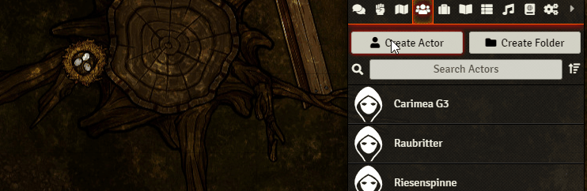
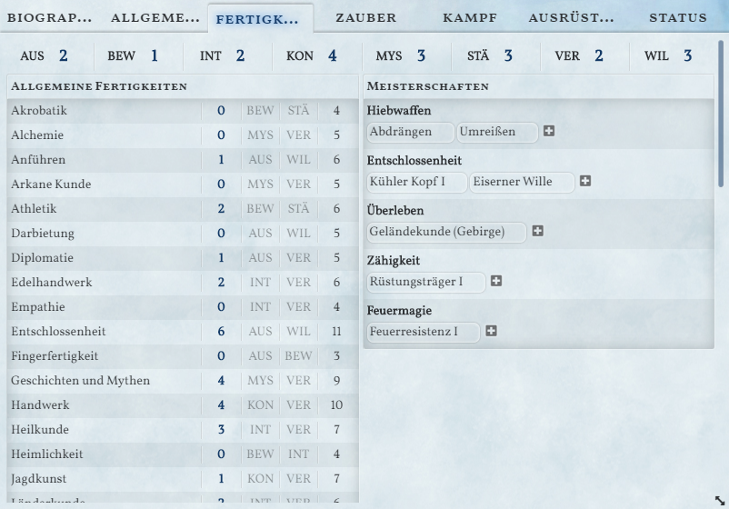
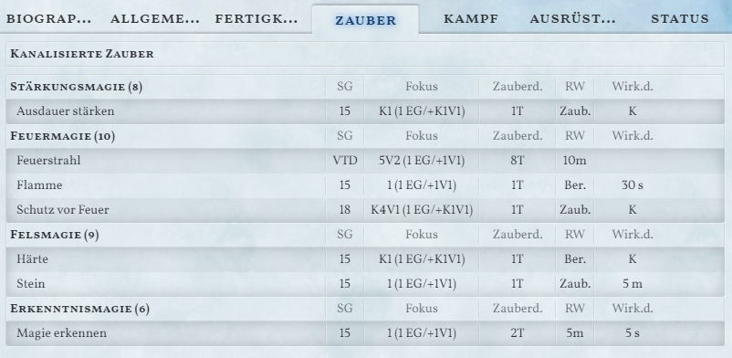

# Splittermond für Foundry VTT

Dieses Foundry VTT - System implementiert das deutsche Rollenspiel-System [Splittermond](https://splittermond.de/) des [Uhrwerk Verlags](https://www.uhrwerk-verlag.de/). Dieses Fanprojekt implementiert einzelne Regeln, kann jedoch nicht Regeltexte und ein Gesamtkompendium bereitstellen. 

*Dieses System befindet sich noch in Entwicklung. Änderungen können jederzeit vorgenommen werden, die eine Abwärtskompatibilität beeinträchtigen.*

**Installations-URL:** [https://bitbucket.org/rpgframework-cloud/splittermond-fvtt/raw/main/system.json](https://bitbucket.org/rpgframework-cloud/splittermond-fvtt/raw/main/system.json)

## Features
### Genesis Import
Jeder Charakter aus dem Charaktererstellungstool Gensis lässt sich als JSON-Datei importieren.

### Automatische Berechnung von Werten
Alle abgeleiten Werte sowie die Fertigkeitswerte werden aus den Attributen und Fertigkeitspunkten automatisch berechnet.

### Proben
Es können alle Fertigkeitsproben per Klick auf die Fertigkeit, den Zauber oder den Angriff durchgeführt werden.

### Verwaltung von Zauber
Zauber können per Drag-and-Drop auf das Charakterblatt gezogen werden. Diese Werden nach Magieschule geordnet angezeigt.

Per Klick auf den Zaubernamen wird eine entsprechende Probe ausgeführt. Zusätzlich können die Zauberkosten durch Klick auf die Kosten abgerechnet werden. Dabei können die kanalisierten Fokuspunkte nach Zauber getrennt verwaltet werden.

### Ausrüstung
Alle Ausrüstungsgegenstände können getrennt nach ihrem Typ organisiert werden. Dabei lassen sich Waffen, Rüstungen und Schilde zusätzlich als "ausgerüstet" markiert werden.

### Kampfaktionen
Abhängig von den ausgerüsteten Waffen wird unter dem Tab "Kampf" die entsprechenden Angriffsoptionen aufgelistet.

Durch anklicken des Waffennamens kann eine Probe ausgelöst werden. Ist in Foundry VTT ein Ziel ausgewählt, wird dessen Verteidigung automatisch als Schwierigkeit eingetragen.

Durch einen Klick auf den Schaden kann ein Schadenswurf erzeugt werden. Dabei werden auch die Merkmale der Waffe berücksichtigt.

Unter "Aktive Abwehr" werden alle *Aktive Abwehr*-Möglichkeiten der aktuellen Waffe sowie weitere Fertigkeiten aufgelistet.

Bei einem Wurf auf die Aktive Abwehr wird das Waffenmerkmal *Defensiv* hinsichtlich der Erhöhung der Verteidigung berücksichtigt.

### Modifikatoren
Alle Gegenstände als auch Meisterschaften, Stärken, Zustände und Zaubereffekte können Werte innerhalb des Sheets modifizieren.

Eine Liste möglicher Modifikatoren wird noch bereitgestellt.

### Patzertabellen
Kampf- und Zauberpatzertabellen sind implementiert. Per Drag-n-Drop können die Erwürfelten Zustände auf das Charakterblatt gezogen werden. Mali durch Zustände wie z.B. *Erschöpft* werden im Charakterbogen berücksichtigt.

### Fertigkeitswurf fordern
Der Spielleiter kann mittels Makro einen Fertigkeitswurf fordern. Dafür aktiviert er das Makro und wählt die Fertigkeit und Schwierigkeit. Es wird eine Chatnachricht erstellt auf die die Spieler klicken können um einen Fertigkeitswurf auszuführen

Damit diese Funktion genutzt werden kann, müssen die Macros `requestSkillCheck` und `skillCheck` aus dem Makro-Kompendium importiert werden. Zusätzlich muss den Spielern die Berechtigung zur Nutzung des `skillCheck`-Makros freigegeben werden (Eintrag "Permissions" im Kontext-Menü des Makro-Directory).

### Tickleiste
Der in Foundry eingebaute "Combat Tracker" lässt sich nun als Tickleiste verwenden. Die Spieler können auf ihre Waffengeschwindigkeit, Zauberdauer etc. klicken um ihre Ticks zu erhöhen. Außerdem kann ein Spieler auf das "Abwarten/Bereithalten"-Feld gesetzt werden.

### NSC Bogen
Der NSC-Bogen bietet für Nicht-Spieler-Charaktere die Möglichkeit *abgeleitete Werte* sowie eine Auswahl an Fertigkeiten einzutragen.

Gegnermerkmale wie *Schwächlich* haben aufgrund der einstellbaren Modifikatoren Auswirkungen auf die Anzahl der Wundstufen.