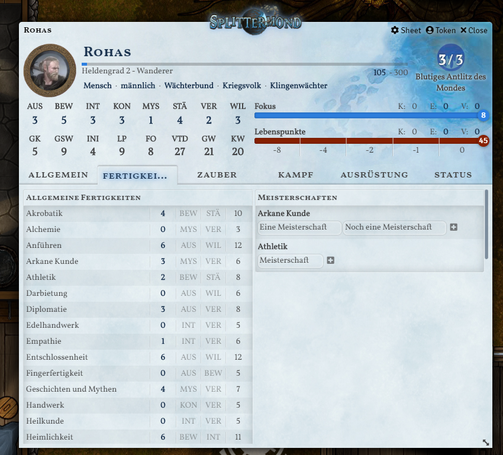

# Foundry VTT Splittermond Plugin #

Installations-URL: [https://bitbucket.org/rpgframework-cloud/splittermond-fvtt/raw/main/system.json](https://bitbucket.org/rpgframework-cloud/splittermond-fvtt/raw/main/system.json)

Auch wenn man hiermit schon gut arbeiten kann: wir sind noch in der Entwicklung.
Es ist möglich, dass wir Änderungen machen, die die Abwärtskompatibilität stören.