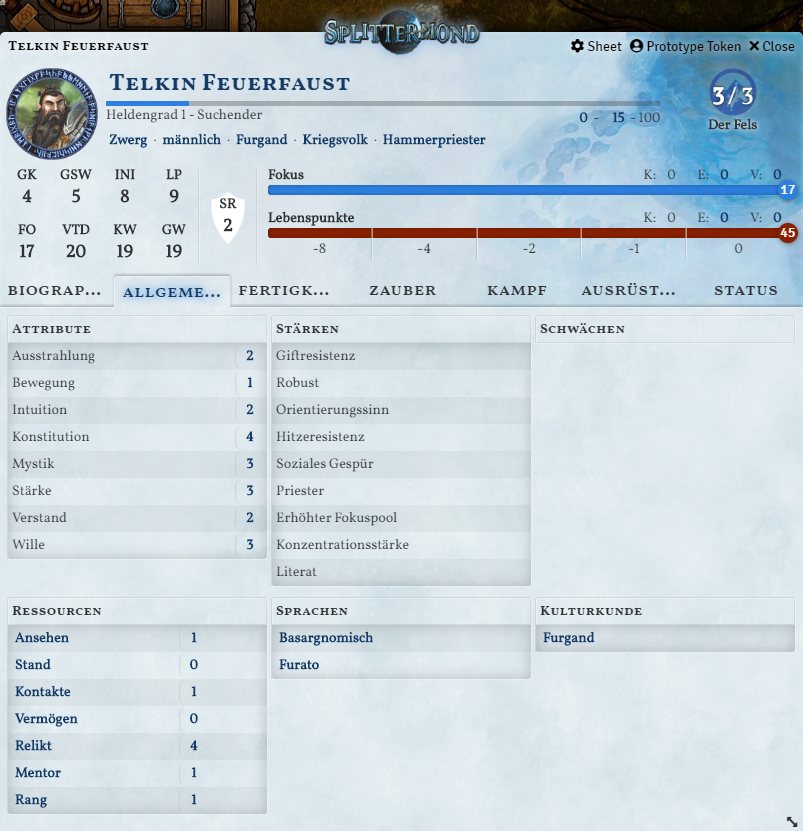
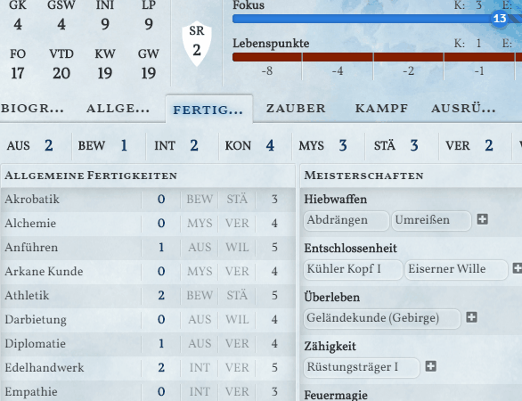
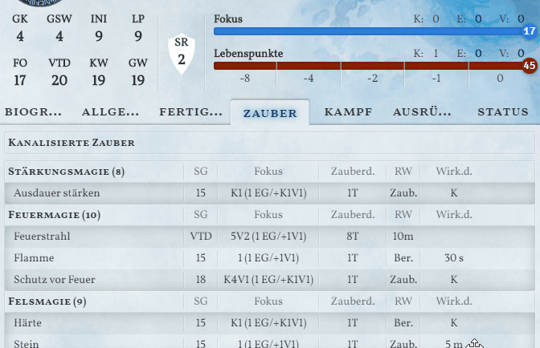
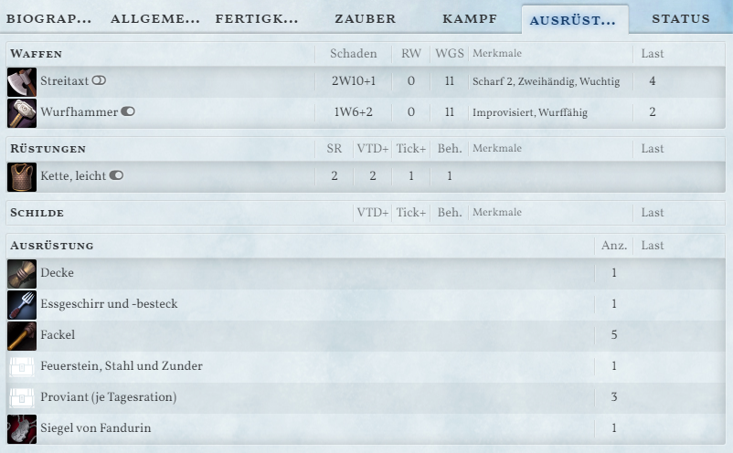
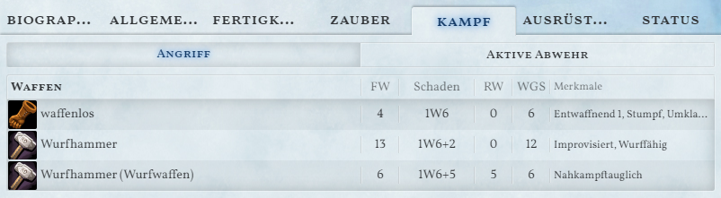
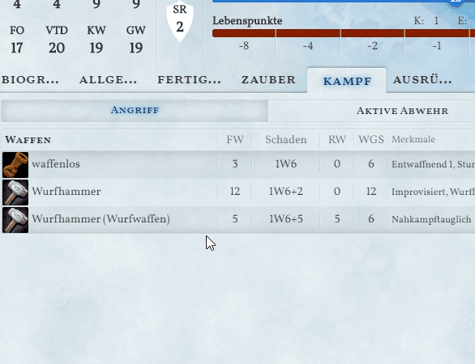
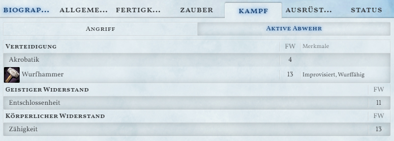
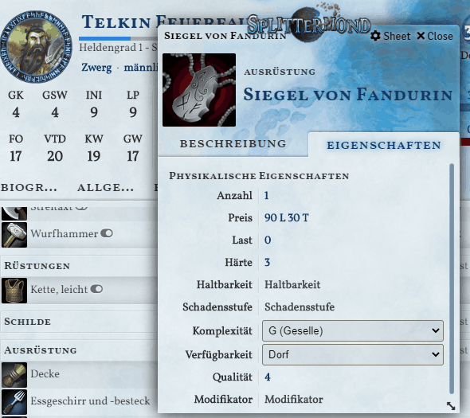

# Splittermond für Foundry VTT

Dieses Foundry VTT - System implementiert das deutsche Rollenspiel-System [Splittermond](https://splittermond.de/). Dieses Fanprojekt implementiert einzelne Regeln, kann jedoch nicht Regeltexte und ein Gesamtkompendium bereitstellen. 

*Dieses System befindet sich noch in Entwicklung. Änderungen können jederzeit vorgenommen werden, die eine Abwärtskompatibilität beeinträchtigen.*

**Installations-URL:** [https://bitbucket.org/rpgframework-cloud/splittermond-fvtt/raw/main/system.json](https://bitbucket.org/rpgframework-cloud/splittermond-fvtt/raw/main/system.json)

## Features
### Automatische Berechnung von Werten
Alle abgeleiten Werte sowie die Fertigkeitswerte werden aus den Attributen und Fertigkeitspunkten automatisch berechnet.

### Proben
Es können alle Fertigkeitsproben per Klick auf die Fertigkeit, den Zauber oder den Angriff durchgeführt werden.

### Verwaltung von Zauber
Zauber können per Drag-and-Drop auf das Charakterblatt gezogen werden. Diese Werden nach Magieschule geordnet angezeigt.

Per Klick auf den Zaubernamen wird eine entsprechende Probe ausgeführt. Zusätzlich können die Zauberkosten durch Klick auf die Kosten abgerechnet werden. Dabei können die kanalisierten Fokuspunkte nach Zauber getrennt verwaltet werden.

### Ausrüstung
Alle Ausrüstungsgegenstände können getrennt nach ihrem Typ organisiert werden. Dabei lassen sich Waffen, Rüstungen und Schilde zusätzlich als "ausgerüstet" markiert werden.

### Kampfaktionen
Abhängig von den ausgerüsteten Waffen wird unter dem Tab "Kampf" die entsprechenden Angriffsoptionen aufgelistet.

Durch anklicken des Waffennamens kann eine Probe ausgelöst werden.

Durch einen Klick auf den Schaden kann ein Schadenswurf erzeugt werden. Dabei werden auch die Merkmale der Waffe berücksichtigt.

Unter "Aktive Abwehr" werden alle *Aktive Abwehr*-Möglichkeiten der aktuellen Waffe sowie weitere Fertigkeiten aufgelistet.

Bei einem Wurf auf die Aktive Abwehr wird das Waffenmerkmal *Defensiv* hinsichtlich der Erhöhung der Verteidigung berücksichtigt.

### Modifikatoren
Alle Gegenstände als auch Meisterschaften, Stärken, Zustände und Zaubereffekte können Werte innerhalb des Sheets modifizieren.

Eine Liste möglicher Modifikatoren wird noch bereitgestellt.